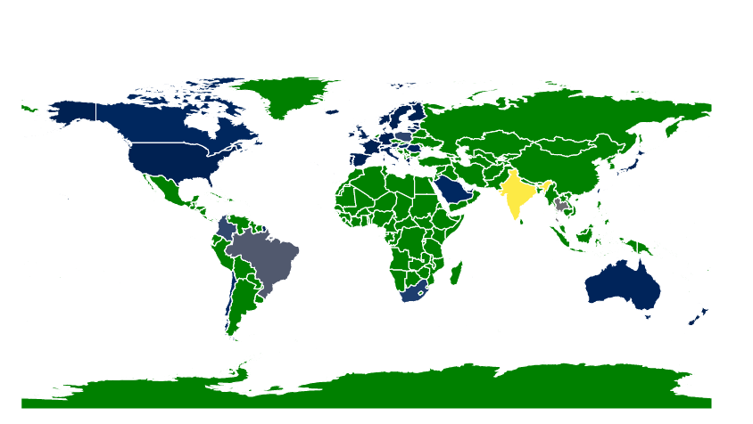

### Intro  
## Greetings 👋, I'm Kamalraj!  
  

  
  

### What I do...  

Self motivated professional with a experience in Data Engineering,Analytics and Visualisation. 13+ years of Industry experience with 3+ years in IT services.  

Experienced at data gathering and market research with tools like Python, Javascript, SQL and Excel.Strong know how about the file types like JSON, CSV and database files. 

Hands on experience on Big Data analytics using Pyspark and Spark SQL. Taken up freelance projects involving DATA ETL from multiple sources and created Data pipeline using Pyspark. 

Creating dashboards and expertise in converting business metrics into SQL queries. Skilled at OLAP and dimensional modelling like Star,  Snowflake and Hub & Spoke Schema. 

Specialties: Data Extraction, Transformation and Visualisation. Data loading into Spark and Postgres Data base
Cloud Technology : AWS Boto3, EC2, Redshift
ETL : Excel Advanced, SQL, Python's Pandas & Pyspark, JavaScript's D3.js
VCS : Comfortable with Git and Github 
Operating System: Linux Arch and Debian flavors
Programming Languages: Intermediate Python, Javascript and Bash Shell scripting
Databases : Postgres
Office Tools : Excel, Powerpoint and Word

I love working with Data and shape it into stories that create impact. I specialize in D3.js and manipulating DOM elements. Motivation to learn D3 came from my life long motivation to Mastery. To use the tool with an ease of a Pencil. The blank HTML page provides the freedom to create simple to very complex charts that make story telling much easier.  
  
   

## Rapidfire  
<table><tr><td valign="top" width="50%">

### What I Do  
- 🔭 I wrangle, model and move data between databases, processing nodes and finally to visualisation
  

- 🔭 I am fluent with multiple data visualisation and insight generation using huge datasets. 
  

- 🌱 I’m currently mastering Linux Shell scripting, AWS Boto3, Pyspark 
  

- ❓ Ask me anything about the visualisation charts, the data wrangling and problem solving  
  

- ⚡ Fun fact: I still think Sherlock Holmes is real life person  

</td><td valign="top" width="50%">

  

</td></tr></table>  

   

## Languages and Tools  

  
  
  
  
  
  
  
  
  
  

  

   

## Github Stats  
<table><tr><td valign="top" width="50%">

</td><td valign="top" width="50%">

</td></tr></table>  

   

  

   

  
  

   

 

----

Generated using <a href="https://profilinator.rishav.dev/" target="_blank">Github Profilinator</a>

